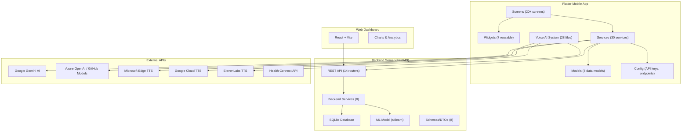

# 📋 ElderCare AI — Complete Project Documentation (A to Z)

> **Version**: 2.1.0 | **Last Updated**: 25 September 2026
> **Tech Stack**: Flutter (Dart) + FastAPI (Python) + SQLite + Gemini AI + Azure OpenAI
> **Platform**: Android (Primary), iOS (Secondary), Web Dashboard (React + Vite)
> **Backend Hosted On**: Render.com (Free Tier) — `https://eldercareai-1.onrender.com`

---

## 📑 TABLE OF CONTENTS

1. [Project Overview & Vision](#1-project-overview--vision)
2. [Complete Architecture Diagram](#2-complete-architecture-diagram)
3. [Technology Stack & Dependencies](#3-technology-stack--dependencies)
4. [Project Directory Structure](#4-project-directory-structure)
5. [Application Entry Point (main.dart)](#5-application-entry-point-maindart)
6. [App Theme System (app_theme.dart)](#6-app-theme-system-app_themedart)
7. [Routing System (app_routes.dart)](#7-routing-system-app_routesdart)
8. [Configuration Layer (config/)](#8-configuration-layer-config)
9. [Data Models (models/)](#9-data-models-models)
10. [Services Layer — Complete Breakdown (services/)](#10-services-layer--complete-breakdown-services)
11. [Voice AI System (voice/)](#11-voice-ai-system-voice)
12. [Screens / UI Pages (screens/)](#12-screens--ui-pages-screens)
13. [Reusable Widgets (widgets/)](#13-reusable-widgets-widgets)
14. [Utils Layer (utils/)](#14-utils-layer-utils)
15. [Backend Server — FastAPI (backend/)](#15-backend-server--fastapi-backend)
16. [Database Schema — SQLAlchemy ORM (database/)](#16-database-schema--sqlalchemy-orm-database)
17. [Backend API Routes (routers/)](#17-backend-api-routes-routers)
18. [Backend Services (backend/services/)](#18-backend-services-backendservices)
19. [Backend Schemas / DTOs (schemas/)](#19-backend-schemas--dtos-schemas)
20. [Machine Learning Pipeline](#20-machine-learning-pipeline)
21. [Web Dashboard (web_dashboard/)](#21-web-dashboard-web_dashboard)
22. [Security Architecture](#22-security-architecture)
23. [Complete API Endpoints Reference](#23-complete-api-endpoints-reference)
24. [Feature Status — What's Done vs Pending](#24-feature-status--whats-done-vs-pending)
25. [Known Issues & Technical Debt](#25-known-issues--technical-debt)
26. [Deployment Guide](#26-deployment-guide)

---

## 1. Project Overview & Vision

### 1.1 What is ElderCare AI?

**ElderCare AI (ElderSaathi)** is a comprehensive AI-powered elder care companion app designed specifically for the Indian market. It protects elderly users from digital fraud (SMS scams, phishing calls), provides health monitoring, prescription reading, AI doctor consultation, and connects them with their guardians (family members) through a real-time monitoring system.

### 1.2 Core Problem Statement

Elderly people in India are the #1 target for:
- **SMS Scams** — Fake bank alerts, lottery scams, KYC fraud
- **Phone Call Fraud** — Impersonation of police/bank/government
- **Health Neglect** — No one monitors their daily health
- **Emergency Isolation** — No quick way to call for help

### 1.3 Solution Architecture

The app has **4 user roles**:

| Role | Description | Dashboard |
|------|-------------|-----------|
| **Elder** | Primary user — the elderly person | `DashboardScreen` |
| **Guardian** | Family member who monitors the elder remotely | `GuardianDashboardScreen` |
| **Child** | Young family member with parental controls | `ChildDashboardScreen` |
| **Admin** | System administrator | Backend only |

### 1.4 Key Feature Modules

| Module | Status | Description |
|--------|--------|-------------|
| 🔐 Authentication System | ✅ Complete | PIN-based login, registration, role selection |
| 📱 SMS Scam Detection | ✅ Complete | On-device heuristic + ML + AI hybrid classifier |
| 🚨 Emergency SOS | ✅ Complete | One-tap SOS with GPS, SMS, backend sync |
| 🩺 AI Doctor (My Buddy) | ✅ Complete | Voice-enabled AI health assistant |
| 💊 Prescription Reader | ✅ Complete | Camera → Gemini Vision → Medicine explanation |
| 📊 Health Profile | ✅ Complete | Multi-profile, BMI calculator, completeness tracking |
| 🏥 Health Monitor | ✅ Complete | Steps, sleep, SpO2, BP via Health Connect |
| 👴 Guardian Dashboard | ✅ Complete | Remote elder monitoring with risk scores |
| 📞 Call Protection | ✅ Complete | Scam caller detection and warning system |
| 🗣️ Voice AI System | ✅ Complete | Multi-engine TTS (Edge/Azure/Google/ElevenLabs) |
| ⏰ Task Reminders | ✅ Complete | Guardian-assigned tasks with notifications |
| 💊 Medicine Tracking | ✅ Complete | Database of 300K+ Indian medicines |
| 📢 Voice Alerts | ✅ Complete | Priority-based spoken alerts for scam/health/SOS |
| 🫨 Shake-to-SOS | ✅ Complete | Accelerometer-based emergency trigger |
| 🌙 Dark/Light Theme | ✅ Complete | System-aware theming with font scaling |
| 👶 Child Dashboard | ✅ Complete | Digital wellbeing, app usage, parental controls |
| 📊 Web Dashboard | ✅ Complete | React-based admin/guardian web interface |
| 🔄 Background Service | ✅ Complete | Always-on SMS monitoring, foreground notification |

---

## 2. Complete Architecture Diagram



---

## 3. Technology Stack & Dependencies

### 3.1 Flutter (Mobile App)

**SDK**: Dart ^3.8.0 | Flutter (latest stable)

| Package | Version | Purpose |
|---------|---------|---------|
| `google_fonts` | ^6.2.1 | Inter font family for UI |
| `http` | ^1.2.0 | HTTP networking |
| `shared_preferences` | ^2.2.0 | Local key-value storage |
| `intl` | ^0.19.0 | Date/time formatting |
| `geolocator` | ^13.0.1 | GPS location for SOS |
| `permission_handler` | ^11.3.1 | Runtime permission management |
| `flutter_contacts` | ^1.1.9+2 | Contact book access |
| `uuid` | ^4.5.1 | UUID generation |
| `url_launcher` | ^6.3.1 | Launch URLs/SMS/Phone |
| `image_picker` | ^1.2.1 | Camera/gallery access |
| `flutter_background_service` | ^5.0.0 | Always-on background processing |
| `flutter_local_notifications` | ^17.0.0 | Push notifications |
| `speech_to_text` | ^7.3.0 | Voice-to-text (STT) |
| `flutter_tts` | ^4.2.5 | Built-in text-to-speech |
| `another_telephony` | ^0.4.0 | SMS listening (foreground + background) |
| `sensors_plus` | ^6.1.1 | Accelerometer for shake detection |
| `pedometer` | ^4.0.2 | Step counting |
| `health` | ^11.1.0 | Health Connect integration |
| `vibration` | ^2.0.0 | Haptic feedback |
| `just_audio` | ^0.9.40 | Audio playback (TTS) |
| `path_provider` | ^2.1.0 | File system paths |
| `flutter_dotenv` | ^5.1.0 | .env file loading |
| `connectivity_plus` | ^7.0.0 | Network state detection |
| `crypto` | ^3.0.3 | SHA256 hashing |
| `heart_bpm` | ^2.0.0+0 | Camera-based heart rate |
| `webview_flutter` | ^4.13.1 | In-app web views |
| `geocoding` | ^4.0.0 | Reverse geocoding |
| `app_usage` | ^4.1.0 | App usage statistics |
| `installed_apps` | ^2.1.1 | List installed apps |

### 3.2 Backend (Python)

| Package | Purpose |
|---------|---------|
| `fastapi` | REST API framework |
| `uvicorn` | ASGI server |
| `sqlalchemy` | ORM for SQLite |
| `python-jose[cryptography]` | JWT tokens |
| `passlib[bcrypt]` | Password hashing |
| `python-multipart` | Form data parsing |
| `scikit-learn` | ML model for SMS classification |
| `joblib` | ML model serialization |
| `pandas` | Data processing |
| `httpx` | Async HTTP client |
| `google-generativeai` | Gemini AI SDK |

### 3.3 Web Dashboard

| Package | Purpose |
|---------|---------|
| `react` | UI framework |
| `vite` | Build tool |
| `recharts` | Charting library |

---

## 4. Project Directory Structure

```
ElderCareAI/
├── .env                          # API keys (gitignored)
├── pubspec.yaml                  # Flutter dependencies
├── requirements.txt              # Python dependencies
├── A_Z_medicines_dataset_of_India.csv  # 300K+ medicines (32MB)
│
├── lib/                          # ═══ FLUTTER SOURCE ═══
│   ├── main.dart                 # App entry point (211 lines)
│   ├── app_theme.dart            # Material 3 theme (144 lines)
│   ├── app_routes.dart           # Named route generator (41 lines)
│   │
│   ├── config/
│   │   └── api_config.dart       # All API endpoints & keys (125 lines)
│   │
│   ├── models/                   # ═══ DATA MODELS ═══
│   │   ├── alert_model.dart      # AlertModel + ElderStatsModel (70 lines)
│   │   ├── call_models.dart      # CallReputation + ScamCategory + CallerInfo (77 lines)
│   │   ├── guardian_model.dart   # GuardianModel (57 lines)
│   │   ├── health_profile.dart   # HealthProfile with BMI, completeness (189 lines)
│   │   ├── medication.dart       # Medicine + UserMedication (86 lines)
│   │   ├── risk_model.dart       # RiskModel (35 lines)
│   │   ├── sms_model.dart        # SmsModel (95 lines)
│   │   └── task_model.dart       # TaskModel (68 lines)
│   │
│   ├── services/                 # ═══ BUSINESS LOGIC (30 FILES) ═══
│   │   ├── alert_policy.dart                # Smart notification policy
│   │   ├── api_service.dart                 # Central API client (854 lines)
│   │   ├── app_logger.dart                  # Structured logging system
│   │   ├── auth_service.dart                # Auth + JWT + session (336 lines)
│   │   ├── background_service.dart          # Always-on SMS monitoring (574 lines)
│   │   ├── battery_optimizer_service.dart   # OEM battery optimization
│   │   ├── child_controls_service.dart      # Parental controls
│   │   ├── digital_wellbeing_service.dart   # Screen time tracking
│   │   ├── emergency_service.dart           # SOS system (441 lines)
│   │   ├── google_fit_service.dart          # Google Fit integration
│   │   ├── health_profile_service.dart      # Multi-profile health (360 lines)
│   │   ├── health_service.dart              # Health Connect (251 lines)
│   │   ├── location_service.dart            # GPS location
│   │   ├── medicine_reminder_service.dart   # Medicine alert system
│   │   ├── network_manager.dart             # Online/offline detection
│   │   ├── phone_lookup_service.dart        # Phone number verification
│   │   ├── prescription_history_service.dart # Prescription storage
│   │   ├── prescription_service.dart        # Gemini Vision OCR (363 lines)
│   │   ├── reputation_service.dart          # Call reputation scoring
│   │   ├── resilient_http.dart              # Retry + backoff + offline queue (315 lines)
│   │   ├── risk_score_engine.dart           # Client-side risk scoring (257 lines)
│   │   ├── risk_score_provider.dart         # Reactive risk UI provider (178 lines)
│   │   ├── settings_service.dart            # Theme, font, toggles (144 lines)
│   │   ├── shake_detector_service.dart      # Accelerometer SOS (162 lines)
│   │   ├── sms_classifier.dart              # On-device scam AI (2146 lines!)
│   │   ├── sms_listener_service.dart        # Foreground SMS listener
│   │   ├── system_status_manager.dart       # System health monitoring
│   │   ├── task_reminder_service.dart       # Task polling + notifications
│   │   ├── user_memory_service.dart         # User preference memory
│   │   └── voice_alert_service.dart         # Priority voice alerts (210 lines)
│   │
│   ├── voice/                    # ═══ VOICE AI SYSTEM (28 FILES) ═══
│   │   ├── action_handler.dart              # Voice command execution
│   │   ├── ai_brain_service.dart            # Gemini AI conversation engine
│   │   ├── assistant_widget.dart            # Floating AI assistant UI
│   │   ├── azure_tts_service.dart           # Azure Speech Service TTS
│   │   ├── caregiver_filter.dart            # Content filtering for caregivers
│   │   ├── child_brain_service.dart         # Child-specific AI responses
│   │   ├── child_voice_controller.dart      # Child voice interaction
│   │   ├── conversation_memory.dart         # Multi-turn conversation state
│   │   ├── edge_tts_service.dart            # Microsoft Edge TTS (FREE)
│   │   ├── elevenlabs_service.dart          # ElevenLabs premium voices
│   │   ├── emergency_detector.dart          # Emergency phrase detection
│   │   ├── emotion_tagger.dart              # Emotion detection in speech
│   │   ├── google_tts_service.dart          # Google Cloud TTS
│   │   ├── intent_router.dart               # NLU intent classification
│   │   ├── language_detector.dart           # Hindi/English detection
│   │   ├── medical_response_parser.dart     # Medical text extraction
│   │   ├── medication_voice_alert.dart      # Medicine reminder voice
│   │   ├── offline_command_handler.dart     # Offline voice commands
│   │   ├── proactive_health_service.dart    # Proactive health check-ins
│   │   ├── speech_naturalizer.dart          # Makes AI speech more natural
│   │   ├── speech_service.dart              # Speech-to-text wrapper
│   │   ├── text_normalizer.dart             # Text cleanup for TTS
│   │   ├── tts_service.dart                 # TTS orchestrator (multi-engine)
│   │   ├── tts_text_cleaner.dart            # TTS-specific text cleaning
│   │   ├── voice_controller.dart            # Main voice interaction controller
│   │   ├── voice_engine.dart                # Core TTS engine (19K bytes)
│   │   ├── voice_selector.dart              # Voice preference management
│   │   └── wake_word_service.dart           # Wake word detection
│   │
│   ├── screens/                  # ═══ UI SCREENS (20+ FILES) ═══
│   │   ├── ai_doctor_screen.dart            # AI Doctor consultation (46KB)
│   │   ├── alerts_history_screen.dart       # Safety alerts history
│   │   ├── call_protection_screen.dart      # Call scam protection
│   │   ├── dashboard_screen.dart            # Elder main dashboard (25KB)
│   │   ├── elder_detail_screen.dart         # Guardian's elder detail view (36KB)
│   │   ├── guardian_dashboard_screen.dart   # Guardian overview (33KB)
│   │   ├── guardian_settings_screen.dart    # Guardian settings
│   │   ├── guardian_setup_screen.dart       # Guardian linking (27KB)
│   │   ├── guardian_task_assign_screen.dart # Task assignment UI
│   │   ├── health_monitor_screen.dart       # Live health data
│   │   ├── health_profile_view_screen.dart  # Health profile view (54KB!)
│   │   ├── login_screen.dart                # Login page (19KB)
│   │   ├── my_buddy_screen.dart             # AI buddy screen
│   │   ├── my_health_screen.dart            # My health dashboard (32KB)
│   │   ├── prescription_reader_screen.dart  # Prescription scanner (23KB)
│   │   ├── register_screen.dart             # Registration (21KB)
│   │   ├── reset_pin_screen.dart            # PIN reset (12KB)
│   │   ├── sms_analyzer_screen.dart         # SMS analysis UI (38KB)
│   │   ├── sos_screen.dart                  # SOS emergency (24KB)
│   │   ├── child_dashboard/                 # ═══ CHILD MODULE ═══
│   │   │   ├── animated_background.dart
│   │   │   ├── child_main_screen.dart
│   │   │   ├── child_profile_screen.dart    # (75KB!)
│   │   │   └── tabs/
│   │   │       ├── focus_tab.dart
│   │   │       ├── home_tab.dart
│   │   │       ├── insights_tab.dart
│   │   │       ├── safety_tab.dart
│   │   │       └── timeline_tab.dart
│   │   ├── profile/
│   │   │   └── profile_screen.dart          # (78KB!)
│   │   └── settings/
│   │       ├── contacts_screen.dart
│   │       └── settings_screen.dart
│   │
│   ├── widgets/                  # ═══ REUSABLE WIDGETS ═══
│   │   ├── dashboard_card.dart
│   │   ├── error_banner.dart
│   │   ├── health_profile_card.dart
│   │   ├── page_transition.dart
│   │   ├── risk_indicator.dart
│   │   ├── sos_button.dart
│   │   └── task_reminder_card.dart
│   │
│   └── utils/
│       └── phone_hasher.dart
│
├── backend/                      # ═══ PYTHON BACKEND ═══
│   ├── main.py                   # FastAPI app + middleware (190 lines)
│   ├── requirements.txt          # Python packages
│   ├── Procfile                  # Render deployment
│   ├── sms_model.pkl             # Trained ML model (564KB)
│   ├── SMSSpamCollection         # Training dataset
│   ├── train_pipeline.py         # ML training script
│   │
│   ├── database/
│   │   ├── engine.py             # SQLAlchemy engine + session
│   │   ├── models.py             # 16 ORM models (311 lines)
│   │   └── call_models.py        # Call-specific models
│   │
│   ├── routers/                  # ═══ API ROUTES (14 ROUTERS) ═══
│   │   ├── auth.py               # Authentication routes
│   │   ├── alerts.py             # Alert management
│   │   ├── call_protection.py    # Call reputation
│   │   ├── contacts.py           # Emergency contacts
│   │   ├── edge_tts_router.py    # Edge TTS proxy
│   │   ├── guardian.py           # Guardian features
│   │   ├── health.py             # Health data
│   │   ├── medication.py         # Medicine database
│   │   ├── risk.py               # Risk scoring
│   │   ├── sms.py                # SMS analysis
│   │   ├── sos.py                # SOS handling
│   │   ├── tasks.py              # Task management
│   │   └── voice.py              # Voice endpoints
│   │
│   ├── services/                 # ═══ BACKEND SERVICES ═══
│   │   ├── ai_sms_analyzer.py    # Gemini AI SMS analysis
│   │   ├── analysis_service.py   # Rule-based + ML + AI analysis (620 lines)
│   │   ├── auth_service.py       # JWT + password hashing
│   │   ├── firebase_service.py   # Push notification service
│   │   ├── ml_model.py           # sklearn SMS classifier
│   │   ├── risk_service.py       # Risk scoring engine (376 lines)
│   │   └── scam_scoring.py       # Advanced scam scoring
│   │
│   ├── schemas/                  # ═══ PYDANTIC SCHEMAS ═══
│   │   ├── schemas.py            # Auth schemas
│   │   ├── call_schemas.py       # Call protection schemas
│   │   ├── contact_schemas.py    # Contact schemas
│   │   ├── guardian_schemas.py   # Guardian schemas
│   │   ├── health_schemas.py     # Health schemas
│   │   ├── medication_schemas.py # Medicine schemas
│   │   └── task_schemas.py       # Task schemas
│   │
│   └── utils/
│       └── phone_utils.py        # Phone number normalization
│
└── web_dashboard/                # ═══ WEB DASHBOARD ═══
    ├── index.html
    ├── package.json
    ├── vite.config.js
    └── src/
        ├── App.jsx               # Main dashboard component (33KB)
        ├── App.css               # Dashboard styles
        ├── index.css             # Global styles
        └── main.jsx              # React entry point
```

---

## 5. Application Entry Point (main.dart)

**File**: [`lib/main.dart`](file:///d:/Vibe%20projects/ElderCare%20Ai/ElderCareAI/lib/main.dart) | **Lines**: 211

### 5.1 Boot Sequence (Detailed)

The app boots in a very specific order to prevent Android crashes:

```
1. WidgetsFlutterBinding.ensureInitialized()
2. Load .env file (API keys)
3. Register global error handlers (FlutterError + PlatformDispatcher)
4. Start Background Service (initECAIBackground) — 10s timeout
5. Batch request ALL Android permissions (SMS, Phone, Notification, Activity, Location)
6. Initialize SMS Listener (foreground)
7. Initialize AuthService (5s timeout)
8. Initialize SettingsService (3s timeout) — loads theme before UI
9. Fire-and-forget: _runAsyncInitializations()
   ├── EmergencyService.init() — loads contacts
   ├── ShakeDetectorService.start() — accelerometer
   ├── Battery optimization exemption
   └── RiskScoreProvider.init() — starts decay timer
10. Determine home screen based on role:
    ├── Guardian → GuardianDashboardScreen
    ├── Child → ChildDashboardScreen
    └── Elder → DashboardScreen
    └── Not logged in → LoginScreen
11. runApp(ElderCareApp)
```

### 5.2 Key Functions

| Function | Line | Purpose |
|----------|------|---------|
| `main()` | 23 | Wrapped in `runZonedGuarded` for crash safety |
| `_runAsyncInitializations()` | 72 | Non-blocking service initialization |
| `_initNonCriticalServices()` | 142 | Emergency, shake, risk score init |
| `ElderCareApp` class | 180 | Root `MaterialApp` with theme + routes |
| `ElderCareApp.build()` | 185 | Uses `AnimatedBuilder` on `SettingsService` for live theme + font scale updates |

### 5.3 Critical Design Decisions

- **Permission Batching**: All permissions requested via a single `[].request()` call to prevent Android 14+ crashes from multiple simultaneous permission intents
- **Sequential Auth Init**: Auth must complete before determining home screen
- **Theme Pre-loading**: `SettingsService().init()` runs before `runApp` to prevent theme flash
- **`unawaited()` Pattern**: Non-critical services run without blocking app start

---

## 6. App Theme System (app_theme.dart)

**File**: [`lib/app_theme.dart`](file:///d:/Vibe%20projects/ElderCare%20Ai/ElderCareAI/lib/app_theme.dart) | **Lines**: 144

### 6.1 Color Palette

| Theme | Primary | Secondary | Background | Surface |
|-------|---------|-----------|------------|---------|
| **Dark** | `#4FC3F7` (Sky Blue) | `#7C4DFF` (Purple) | `#12122A` | `#1A1A2E` |
| **Light** | `#2E7D32` (Green) | `#7C4DFF` (Purple) | `#F0FAF4` | White |

### 6.2 Key Design Tokens

- **Font**: Google Fonts Inter — `GoogleFonts.inter()`
- **Border Radius**: 14px (inputs) / 20px (cards)
- **Elevation**: 0 (flat design)
- **Material 3**: `useMaterial3: true`
- **Dark Surface Variant**: `#222244`
- **Light Surface Variant**: `#E1F5E8`

### 6.3 Functions

| Function | Purpose |
|----------|---------|
| `AppTheme.darkTheme` | Complete dark `ThemeData` |
| `AppTheme.lightTheme` | Complete light `ThemeData` |

---

## 7. Routing System (app_routes.dart)

**File**: [`lib/app_routes.dart`](file:///d:/Vibe%20projects/ElderCare%20Ai/ElderCareAI/lib/app_routes.dart) | **Lines**: 41

### 7.1 Defined Routes

| Route | Screen | Description |
|-------|--------|-------------|
| `/login` | `LoginScreen` | Auth entry |
| `/dashboard` | `DashboardScreen` | Elder home |
| `/guardian-dashboard` | `GuardianDashboardScreen` | Guardian home |
| `/sms-analyzer` | `SmsAnalyzerScreen` | SMS scam checker |
| `/sos` | `SosScreen` | Emergency SOS |
| `/ai-doctor` | `AiDoctorScreen` | AI health assistant |
| `/health-profile-view` | `HealthProfileViewScreen` | Health data view |

All routes use `PageTransition` widget for smooth fade-in animations.

---

## 8. Configuration Layer (config/)

**File**: [`lib/config/api_config.dart`](file:///d:/Vibe%20projects/ElderCare%20Ai/ElderCareAI/lib/config/api_config.dart) | **Lines**: 125

### 8.1 API Endpoints Configuration

| Config | Value |
|--------|-------|
| `baseUrl` | `https://eldercareai-1.onrender.com` |
| `geminiModel` | `gemini-3.5-flash` |
| `geminiEndpoint` | Google Generative AI v1beta |
| `azureOpenAiEndpoint` | Dynamic: GitHub Models if `ghp_` prefix, else Azure |
| `edgeTtsDefaultVoice` | `hi-IN-SwaraNeural` |
| `elevenLabsModel` | `eleven_multilingual_v2` |

### 8.2 TTS Engine Priority

1. **Edge TTS** (FREE, always enabled) — `hi-IN-SwaraNeural`
2. **Google Cloud TTS** — `hi-IN-Neural2-A`
3. **ElevenLabs** — `eleven_multilingual_v2`
4. **Azure Speech** (DEPRECATED) — disabled

### 8.3 Key Functions

| Function | Purpose |
|----------|---------|
| `isAzureOpenAiEnabled` | Check if Azure key is configured |
| `azureOpenAiEndpoint` | Smart endpoint: GitHub AI or Azure based on key prefix |
| `isEdgeTtsEnabled` | Always true (no key needed) |
| `isGoogleTtsEnabled` | Checks if API key exists |
| `isElevenLabsEnabled` | Checks if API key exists |
| `elevenLabsEndpoint(isMale)` | Returns gender-specific voice endpoint |
| `abstractPhoneEndpoint(phone)` | Phone number verification URL |

---

## 9. Data Models (models/)

### 9.1 HealthProfile Model

**File**: [`models/health_profile.dart`](file:///d:/Vibe%20projects/ElderCare%20Ai/ElderCareAI/lib/models/health_profile.dart) | **Lines**: 189

| Field | Type | Description |
|-------|------|-------------|
| `profileId` | String | Unique profile identifier |
| `name` | String? | User's name |
| `dateOfBirth` | DateTime? | For age calculation |
| `gender` | String? | Male/Female/Other |
| `bloodGroup` | String? | A+, B-, etc. |
| `heightCm` | double? | Height in centimeters |
| `weightKg` | double? | Weight in kilograms |
| `medicalConditions` | String? | Free-text conditions |
| `emergencyPhone` | String? | Emergency contact number |
| `city` | String? | City of residence |
| `homeAddress` | String? | Full home address |
| `lastUpdated` | DateTime? | Last modification timestamp |

**Computed Properties**:
- `age` → Computed from `dateOfBirth`
- `bmi` → `weightKg / (heightM * heightM)`
- `bmiCategory` → Underweight/Normal/Overweight/Obese
- `completeness` → 0-100% based on filled fields (9 total)
- `isEmpty` → Whether all key fields are null

**Key Methods**:
- `fromJson()` / `toJson()` — JSON serialization with backward compatibility (supports legacy `age` field)
- `fromJsonString()` / `toJsonString()` — SharedPreferences storage
- `copyWith()` — Immutable updates

### 9.2 SmsModel

**File**: [`models/sms_model.dart`](file:///d:/Vibe%20projects/ElderCare%20Ai/ElderCareAI/lib/models/sms_model.dart) | **Lines**: 95

| Field | Type | Description |
|-------|------|-------------|
| `id` | int? | Backend database ID |
| `sender` | String | SMS sender |
| `body` | String | Message text |
| `riskScore` | double | 0-100 risk score |
| `category` | String | Scam type (phishing, reward_scam, etc.) |
| `isFraud` | bool | Is scam? |
| `explanation` | String | Human-readable explanation |
| `riskEntryId` | int? | Linked risk entry for resolution |
| `isResolved` | bool | Has been marked safe |

**Factory Constructors**:
- `fromJson()` — Standard backend JSON
- `fromAnalysis()` — From `/sms/analyze-sms` response
- `fromHistory()` — From `/sms/sms-history` response
- `fromLocal()` — From SharedPreferences cache

### 9.3 RiskModel

**File**: [`models/risk_model.dart`](file:///d:/Vibe%20projects/ElderCare%20Ai/ElderCareAI/lib/models/risk_model.dart) | **Lines**: 35

| Field | Type | Description |
|-------|------|-------------|
| `score` | double | Risk score 0-100 |
| `level` | String | Safe/Low/Moderate/High |
| `details` | String | Human explanation |
| `activeThreats` | int | Number of active threats |
| `lastScamAt` | DateTime? | When last scam was detected |
| `isVulnerable` | bool | Elderly/medical condition flag |

### 9.4 GuardianModel

**File**: [`models/guardian_model.dart`](file:///d:/Vibe%20projects/ElderCare%20Ai/ElderCareAI/lib/models/guardian_model.dart) | **Lines**: 57

| Field | Type | Description |
|-------|------|-------------|
| `id` | int | Database ID |
| `userId` | int | Linked user ID |
| `name` | String | Guardian name |
| `phone` | String | Phone number |
| `email` | String? | Optional email |
| `isPrimary` | bool | Primary guardian flag |
| `canViewLocation` | bool | Privacy setting |
| `canViewHealth` | bool | Privacy setting |
| `receivesSOS` | bool | Receives SOS alerts |

### 9.5 AlertModel + ElderStatsModel

**File**: [`models/alert_model.dart`](file:///d:/Vibe%20projects/ElderCare%20Ai/ElderCareAI/lib/models/alert_model.dart) | **Lines**: 70

**AlertModel**: `{id, type, title, details, severity, isRead, createdAt}`
**ElderStatsModel**: `{id, elderName, elderPhone, riskScore, lastSosAt, unreadAlertsCount, recentAlerts}`

### 9.6 CallReputation + ScamCategory + CallerInfo

**File**: [`models/call_models.dart`](file:///d:/Vibe%20projects/ElderCare%20Ai/ElderCareAI/lib/models/call_models.dart) | **Lines**: 77

**CallReputation**: `{riskScore, riskLevel, category, reportCount, warningMessage, recommendedAction, confidence}`
**ScamCategory** enum: `loanScam, bankFraud, otpScam, investmentFraud, impersonation, prizeScam, techSupport, other`
**CallerInfo**: `{phoneNumber, displayNumber, isContact, contactName}`

### 9.7 Medicine + UserMedication

**File**: [`models/medication.dart`](file:///d:/Vibe%20projects/ElderCare%20Ai/ElderCareAI/lib/models/medication.dart) | **Lines**: 86

**Medicine**: `{id, name, composition, manufacturer, price, type, packSize}`
**UserMedication**: `{id, userId, medicine, dosageValue, dosageUnit, frequencyPerDay, timeOfDay, startDate, endDate, notes}`

### 9.8 TaskModel

**File**: [`models/task_model.dart`](file:///d:/Vibe%20projects/ElderCare%20Ai/ElderCareAI/lib/models/task_model.dart) | **Lines**: 68

| Field | Type | Description |
|-------|------|-------------|
| `id` | int | Task ID |
| `guardianId` | int | Assigned by |
| `elderId` | int | Assigned to |
| `title` | String | Task title |
| `taskType` | String | custom/medicine/exercise/etc. |
| `description` | String? | Detailed description |
| `iconKey` | String | Icon identifier |
| `scheduledTime` | DateTime? | When to remind |
| `recurrence` | String | once/daily/weekly |
| `status` | String | pending/completed/snoozed |
| `priority` | String | normal/high/urgent |

---

## 10. Services Layer — Complete Breakdown (services/)

### 10.1 AuthService (auth_service.dart)

**File**: [`services/auth_service.dart`](file:///d:/Vibe%20projects/ElderCare%20Ai/ElderCareAI/lib/services/auth_service.dart) | **Lines**: 336 | **Pattern**: Singleton

| Method | Return | Description |
|--------|--------|-------------|
| `init()` | `Future<void>` | Restore session from SharedPreferences |
| `register({name, phone, pin, role})` | `Future<bool>` | Register new user, save JWT |
| `login(phone, pin)` | `Future<UserProfile>` | Authenticate, save JWT + user data |
| `refreshToken()` | `Future<bool>` | Refresh expired JWT |
| `resetPin(phone, newPin)` | `Future<bool>` | Reset PIN via backend |
| `logout()` | `Future<void>` | Clear all caches + tokens + health data |
| `normalizePhone(phone)` | `String` (static) | Extract last 10 digits |

**UserProfile** inner class: `{id, name, phone, role, isActive, isPhoneVerified, profilePhoto, createdAt, lastLoginAt}`

**UserRole** enum: `elder, guardian, child, admin`

### 10.2 ApiService (api_service.dart)

**File**: [`services/api_service.dart`](file:///d:/Vibe%20projects/ElderCare%20Ai/ElderCareAI/lib/services/api_service.dart) | **Lines**: 854 | **Pattern**: Singleton

This is the **central nervous system** — ALL backend calls go through here.

| Method | Return | Endpoint | Description |
|--------|--------|----------|-------------|
| `checkHealth()` | `Future<bool>` | `GET /` | Server alive check |
| `getRiskScore()` | `Future<RiskModel?>` | `GET /risk` | Current risk score (with cache) |
| `getElderRiskScore(elderId)` | `Future<RiskModel?>` | `GET /elder/risk-score` | Elder's risk (guardian use) |
| `resolveRisk(id)` | `Future<bool>` | `POST /risk/resolve/{id}` | Mark threat as resolved |
| `syncRiskScore({score, threats})` | `Future<bool>` | `POST /risk/sync` | Push local score to backend |
| `analyzeSms(message)` | `Future<SmsModel?>` | `POST /sms/analyze-sms` | Analyze single SMS |
| `getSmsHistory()` | `Future<List<SmsModel>>` | `GET /sms/sms-history` | Fetch analyzed SMS history |
| `resolveSmsRisk(id)` | `Future<RiskModel?>` | `POST /risk/resolve/{id}` | Resolve + refresh |
| `getSmsList()` | `Future<List<SmsModel>>` | — | Local cache only |
| `triggerSos({lat, lng, key})` | `Future<bool>` | `POST /sos` | Backend SOS sync |
| `getContacts()` | `Future<List?>` | `GET /contacts/` | Fetch emergency contacts |
| `addContact(contact)` | `Future<Map?>` | `POST /contacts/` | Add emergency contact |
| `deleteContact(id)` | `Future<bool>` | `DELETE /contacts/{id}` | Remove contact |
| `getHealthSummary()` | `Future<Map?>` | `GET /health/summary` | Health summary |
| `postVital(type, value, unit)` | `Future<bool>` | `POST /health/` | Post single vital |
| `syncVitalsBatch({...})` | `Future<bool>` | `POST /health/vitals` | Batch sync vitals |
| `getHealthScore()` | `Future<Map?>` | `GET /health/score` | Computed health score |
| `getHealthProfile()` | `Future<Map?>` | `GET /health/profile` | Fetch health profile |
| `saveHealthProfile(data)` | `Future<Map?>` | `POST /health/profile` | Save health profile |
| `getAlerts({isRead})` | `Future<List?>` | `GET /alerts` | Fetch alerts |
| `getElderAlerts(elderId)` | `Future<List<AlertModel>>` | `GET /guardian/elder/{id}/alerts` | Elder's alerts |
| `markAlertRead(alertId)` | `Future<bool>` | `POST /alerts/{id}/read` | Mark as read |
| `deleteAlert(alertId)` | `Future<bool>` | `DELETE /alerts/{id}` | Delete alert |
| `getGuardians()` | `Future<List<GuardianModel>>` | `GET /guardians` | List guardians |
| `addGuardian(name, phone, email)` | `Future<GuardianModel?>` | `POST /guardians` | Add guardian |
| `deleteGuardian(id)` | `Future<bool>` | `DELETE /guardians/{id}` | Remove guardian |
| `getGuardianDashboard()` | `Future<List<ElderStatsModel>>` | `GET /guardian/dashboard` | Guardian overview |
| `uploadProfilePhoto(base64)` | `Future<bool>` | `POST /auth/profile-photo` | Upload photo |
| `getProfilePhoto()` | `Future<String?>` | `GET /auth/profile-photo` | Get photo |
| `changePin(current, new)` | `Future<String?>` | `POST /auth/change-pin` | Change PIN |
| `searchMedicines(query)` | `Future<List<Medicine>>` | `GET /medicines/search` | Search medicine DB |
| `getUserMedications()` | `Future<List<UserMedication>>` | `GET /user/medications` | User's medicines |
| `addUserMedication({...})` | `Future<UserMedication?>` | `POST /user/medications` | Add medication |
| `deleteUserMedication(id)` | `Future<bool>` | `DELETE /user/medications/{id}` | Remove medication |
| `createTask(data)` | `Future<TaskModel?>` | `POST /tasks/create` | Create task |
| `getGuardianAssignedTasks(id)` | `Future<Map?>` | `GET /tasks/guardian/{id}` | Guardian's tasks |
| `getPendingReminders(elderId)` | `Future<List<TaskModel>>` | `GET /tasks/elder/{id}/pending` | Elder's pending tasks |

**Key Design**: All calls go through `ResilientHttp` for retry + offline support. Responses parsed via `compute()` for isolate-based JSON decoding.

### 10.3 ResilientHttp (resilient_http.dart)

**File**: [`services/resilient_http.dart`](file:///d:/Vibe%20projects/ElderCare%20Ai/ElderCareAI/lib/services/resilient_http.dart) | **Lines**: 315 | **Pattern**: Singleton

**Purpose**: Production-hardened HTTP client that wraps ALL outbound network calls.

| Feature | Implementation |
|---------|----------------|
| **Retry with Backoff** | Exponential: 1s, 2s, 4s (max 3 retries) |
| **401 Interceptor** | Auto token refresh on 401, then retry |
| **Timeout** | Read: 10s, Write: 10s (configurable) |
| **Offline Queue** | Store critical events (SOS, high-risk SMS) for later replay |
| **No 4xx Retry** | Client errors (400-499) are never retried |
| **5xx Retry** | Server errors get full retry treatment |

| Method | Description |
|--------|-------------|
| `get(url, {headers, timeout, retries})` | GET with retry |
| `post(url, {headers, body, timeout, retries})` | POST with retry |
| `patch(url, {headers, body, timeout, retries})` | PATCH with retry |
| `delete(url, {headers, timeout, retries})` | DELETE with retry |
| `queueOfflineRequest({method, url, body})` | Queue for offline replay |
| `queueOfflineEvent(event)` | Queue critical event |
| `drainOfflineQueue()` | Flush all queued events |

### 10.4 SMS Classifier (sms_classifier.dart)

**File**: [`services/sms_classifier.dart`](file:///d:/Vibe%20projects/ElderCare%20Ai/ElderCareAI/lib/services/sms_classifier.dart) | **Lines**: 2146 (Largest file!)

**Purpose**: On-device, zero-network, instant SMS scam classification. This is the **heart of the fraud detection system**.

#### Classification Pipeline:

```
SMS Input → OTP Filter → Whitelist Check → Contact Bypass →
  → Signal Scoring Engine (12 signal categories) →
  → Domain Analysis (lookalike detection) →
  → Phishing Link Scanner →
  → Template Memory (fuzzy fingerprint) →
  → Risk Band Assignment → SmsClassification Output
```

#### Signal Categories & Keyword Sets:

| Category | Keywords | Weight |
|----------|----------|--------|
| `_urgencyWords` | 100+ terms (Hindi+English) | Urgency pressure |
| `_financialWords` | 125+ terms | Financial fraud signals |
| `_impersonationWords` | 115+ terms | Authority impersonation |
| `_threatWords` | 100+ terms (Hindi+English) | Fear/threat tactics |
| `_rewardWords` | 100+ terms | Lottery/prize scams |
| `_financialUrgencyWords` | 17 terms | Combined financial+urgency |
| `_walletGamblingWords` | 18 terms | Gambling/wallet bait |
| `_jobWords` | 65+ terms | Job fraud |
| `_deliveryWords` | Delivery scam patterns |
| `_electricityWords` | Electricity bill scams |
| `_gasWords` | Gas/LPG scams |
| `_simWords` | SIM/telecom scams |
| `_kycWords` | KYC fraud patterns |

#### Template Memory System (ScamTemplateMemory):
- In-memory fingerprint store (max 100 entries)
- DJB2 hash for collision resistance
- Fuzzy matching against known scam templates
- Circular eviction on overflow
- NOT persisted across restarts (intentional)

### 10.5 Background Service (background_service.dart)

**File**: [`services/background_service.dart`](file:///d:/Vibe%20projects/ElderCare%20Ai/ElderCareAI/lib/services/background_service.dart) | **Lines**: 574

**Purpose**: Always-on foreground service for SMS monitoring.

| Function | Description |
|----------|-------------|
| `initECAIBackground()` | Configure and start background service |
| `onStart(service)` | Background isolate entry point |
| `backgroundMessageHandler(message)` | Handle SMS in background isolate |
| `processSms(body, sender)` | Full intelligence pipeline |
| `_syncWithBackend(body, sender, classification)` | Backend sync for scam SMS |
| `_showNotification(title, body, isScam)` | Show alert notification |
| `_createNotificationChannel()` | Create Android notification channels |
| `_isOtpOrCode(body)` | Filter OTP/verification messages |
| `_quickHash(text)` | Fast dedup hash |

#### SMS Processing Pipeline (processSms):

```
1. Truncate message (max 2000 chars)
2. Contact bypass check (Truecaller-style)
3. On-device heuristic classification (SmsClassifier.classify)
4. Save locally to SharedPreferences (local_sms_results)
5. Update dynamic risk score (RiskScoreEngine.recordEvent)
6. Backend sync (only for HIGH-RISK messages)
7. Smart alert policy check (AlertPolicy.shouldAlert)
8. Show notification + Voice alert if scam detected
```

### 10.6 Emergency Service (emergency_service.dart)

**File**: [`services/emergency_service.dart`](file:///d:/Vibe%20projects/ElderCare%20Ai/ElderCareAI/lib/services/emergency_service.dart) | **Lines**: 441

| Method | Description |
|--------|-------------|
| `init()` | Load contacts + retry pending SOS |
| `addContact(name, phone, relationship, photo)` | Add emergency contact (optimistic) |
| `removeContact(id)` | Remove contact |
| `triggerSOS()` | **FULL SOS SEQUENCE** |
| `_queuePendingSos({lat, lng, key})` | Offline queue (max 10) |
| `_retryPendingSos()` | Retry queued SOS calls |
| `_determinePosition()` | GPS with permission handling |

#### SOS Sequence:

```
1. Anti-spam cooldown check (60s)
2. Rapid-tap guard (_isSending flag)
3. Get GPS location (5s timeout, fallback to last known)
4. Construct emergency message with Google Maps link
5. Send SMS via native Android SmsManager (MethodChannel)
6. Fallback: Open SMS app if native fails
7. Sync with backend (POST /sos)
8. Queue for offline retry if backend fails
9. Voice confirmation: "SOS message bhej diya gaya hai"
10. 60-second cooldown
```

### 10.7 Risk Score Engine (risk_score_engine.dart)

**File**: [`services/risk_score_engine.dart`](file:///d:/Vibe%20projects/ElderCare%20Ai/ElderCareAI/lib/services/risk_score_engine.dart) | **Lines**: 257

Client-side risk scoring with time-based exponential decay.

| Method | Description |
|--------|-------------|
| `recordEvent({isScam, riskScore})` | Record SMS event, return updated score |
| `getScore()` | Get score with hourly decay applied |
| `applyTimeDecay()` | Fast exponential decay (called every 30s) |
| `getActiveThreats()` | Local active threat count |
| `reset()` | Clear all risk data |

**Tuning Constants**:
- Safe decay: -1 point per safe SMS
- Hourly decay: -2 points/hour
- Spike threshold: 3+ scams in 10 min → 1.5x multiplier
- Exponential decay: score × 0.8 every 30 seconds
- Score range: 0–100 (clamped)

### 10.8 Risk Score Provider (risk_score_provider.dart)

**File**: [`services/risk_score_provider.dart`](file:///d:/Vibe%20projects/ElderCare%20Ai/ElderCareAI/lib/services/risk_score_provider.dart) | **Lines**: 178

Reactive `ChangeNotifier` that bridges `RiskScoreEngine` → UI.

| Method | Description |
|--------|-------------|
| `init()` | Start backend sync + decay timer |
| `refresh()` | Fetch from backend |
| `refreshFromEngine()` | Read from local SharedPreferences |
| `onThreatEvent()` | Called after scam detection |
| `getElderRisk(elderId)` | For guardian use |

**Timers**: Backend sync every 5 min, decay every 30s.

### 10.9 Prescription Service (prescription_service.dart)

**File**: [`services/prescription_service.dart`](file:///d:/Vibe%20projects/ElderCare%20Ai/ElderCareAI/lib/services/prescription_service.dart) | **Lines**: 363

**Purpose**: Reads handwritten prescription images using Gemini Vision API.

| Method | Description |
|--------|-------------|
| `analyzePrescriptionImage(File)` | Full pipeline: validate → base64 → Gemini → parse |
| `_getMimeType(File)` | Detect image MIME type |

**AI Persona**: "Doctor Veda" — Hinglish-speaking medical assistant.

**Model Fallback Chain**: `gemini-3-flash-preview` → `gemini-3.5-flash` → `gemini-3.7-flash` → `gemini-flash-latest`

**Output Format**: Structured Hinglish explanation with:
- Kya Hua Hai (Condition)
- Dawaiyaan (Medicines list with purpose)
- Kaise Leni Hai (Dosage & timing)
- Dhyan Rakhein (Precautions)
- Doctor ko kab dikhayein (Warning signs)

### 10.10 Health Profile Service (health_profile_service.dart)

**File**: [`services/health_profile_service.dart`](file:///d:/Vibe%20projects/ElderCare%20Ai/ElderCareAI/lib/services/health_profile_service.dart) | **Lines**: 360

Multi-profile health persistence with migration support.

| Method | Description |
|--------|-------------|
| `load()` | Load active profile |
| `save(profile)` | Save with timestamp |
| `switchProfile(id)` | Switch active profile |
| `addProfile({name})` | Create new profile |
| `deleteProfile(id)` | Delete (can't delete last) |
| `getProfileName(id)` | Get display name |
| `clear()` | Clear active profile data |
| `hardReset()` | Wipe ALL profile data (logout) |
| `mergeFromApi(data)` | Merge backend data without overwrite |

### 10.11 Health Service (health_service.dart)

**File**: [`services/health_service.dart`](file:///d:/Vibe%20projects/ElderCare%20Ai/ElderCareAI/lib/services/health_service.dart) | **Lines**: 251

Health data from phone sensors + Health Connect.

| Method | Description |
|--------|-------------|
| `initialize()` | Check Health Connect availability |
| `stepStream()` | Live step count stream (pedometer) |
| `getStepsToday()` | Today's total steps |
| `estimateSleep()` | Sleep hours from Health Connect or heuristic |
| `getSpO2()` | Blood oxygen from Health Connect |
| `getBloodPressure()` | Systolic BP |
| `getTemperature()` | Body temperature |
| `calculateHealthScore(steps, sleep, hr)` | 0-100 composite score |

### 10.12 Settings Service (settings_service.dart)

**File**: [`services/settings_service.dart`](file:///d:/Vibe%20projects/ElderCare%20Ai/ElderCareAI/lib/services/settings_service.dart) | **Lines**: 144

| Setting | Default | Description |
|---------|---------|-------------|
| `themeMode` | System | Light/Dark/System |
| `voiceFeedback` | true | Master voice toggle |
| `notifications` | true | Push notifications |
| `fontScale` | 1.0 | 0.8 to 1.4 |
| `shakeSosEnabled` | false | Shake-to-SOS |
| `voiceAlertScam` | true | Scam voice alerts |
| `voiceAlertMedicine` | true | Medicine voice alerts |
| `voiceAlertHealth` | true | Health voice alerts |
| `voiceAlertSos` | true | SOS voice alerts |
| `voiceAlertCallWarning` | true | Call warning voice alerts |

### 10.13 Shake Detector Service (shake_detector_service.dart)

**File**: [`services/shake_detector_service.dart`](file:///d:/Vibe%20projects/ElderCare%20Ai/ElderCareAI/lib/services/shake_detector_service.dart) | **Lines**: 162

**Hardened Parameters**:
- Threshold: 18 m/s² (vehicle-bump resistant)
- Max acceleration: 50 m/s² (sensor noise filter)
- Required shakes: 4 within 2 seconds
- Direction reversal check (filters uni-directional vehicle bumps)
- 60-second cooldown after trigger
- Sampling: ~10Hz (battery efficient)

### 10.14 Voice Alert Service (voice_alert_service.dart)

**File**: [`services/voice_alert_service.dart`](file:///d:/Vibe%20projects/ElderCare%20Ai/ElderCareAI/lib/services/voice_alert_service.dart) | **Lines**: 210

Centralized voice alert system with smart spam filtering.

| Feature | Implementation |
|---------|----------------|
| Priority Interrupt | HIGH priority interrupts current speech |
| Duplicate Suppression | Same message blocked within 30s |
| Rate Limiting | Max 5 alerts per minute |
| Category Toggles | Each category independently toggleable |
| Master Toggle | One switch to disable all voice |

### 10.15 Other Services (Brief)

| Service | Lines | Purpose |
|---------|-------|---------|
| `alert_policy.dart` | ~60 | Smart notification throttling |
| `app_logger.dart` | ~100 | Structured `[CATEGORY]` logging |
| `battery_optimizer_service.dart` | ~200 | OEM battery optimization bypass |
| `child_controls_service.dart` | ~400 | App blocking, time limits |
| `digital_wellbeing_service.dart` | ~80 | Screen time tracking |
| `google_fit_service.dart` | ~280 | Google Fit API bridge |
| `location_service.dart` | ~35 | GPS wrapper |
| `medicine_reminder_service.dart` | ~270 | Schedule medicine notifications |
| `network_manager.dart` | ~25 | `isOnline()` check |
| `phone_lookup_service.dart` | ~55 | APILayer number verification |
| `prescription_history_service.dart` | ~75 | Store past prescriptions |
| `reputation_service.dart` | ~170 | Call reputation scoring |
| `sms_listener_service.dart` | ~170 | Foreground SMS listener init |
| `system_status_manager.dart` | ~200 | Server health + system status |
| `task_reminder_service.dart` | ~65 | Poll backend for pending tasks |
| `user_memory_service.dart` | ~140 | Remember user preferences |

---

## 11. Voice AI System (voice/)

The voice system is the most complex module with **28 files**. It provides a complete conversational AI assistant.

### 11.1 Architecture

```
User speaks → speech_service.dart (STT) →
  → language_detector.dart (Hindi/English) →
  → intent_router.dart (classify intent) →
  → ai_brain_service.dart (Gemini AI response) →
  → medical_response_parser.dart (extract medical info) →
  → speech_naturalizer.dart (make response natural) →
  → text_normalizer.dart (clean text) →
  → tts_text_cleaner.dart (TTS-specific cleanup) →
  → voice_engine.dart (select TTS engine) →
    → edge_tts_service.dart (FREE, primary)
    → google_tts_service.dart (fallback 1)
    → elevenlabs_service.dart (premium)
    → azure_tts_service.dart (legacy)
  → Audio output to speaker
```

### 11.2 Key Voice Files

| File | Lines | Purpose |
|------|-------|---------|
| `voice_controller.dart` | ~650 | Main interaction controller (listen → process → speak) |
| `voice_engine.dart` | ~550 | Core TTS engine with multi-provider fallback |
| `ai_brain_service.dart` | ~680 | Gemini AI conversation brain |
| `intent_router.dart` | ~470 | NLU — classify user intent (health, SOS, medicine, etc.) |
| `action_handler.dart` | ~500 | Execute voice commands (set reminder, check health, etc.) |
| `tts_service.dart` | ~370 | TTS orchestrator — picks best available engine |
| `speech_naturalizer.dart` | ~290 | Makes AI text sound natural in Hinglish |
| `tts_text_cleaner.dart` | ~340 | Remove markdown, emojis, special chars for TTS |
| `text_normalizer.dart` | ~170 | Unicode + whitespace normalization |
| `conversation_memory.dart` | ~80 | Multi-turn context management |
| `emergency_detector.dart` | ~100 | Detect emergency phrases ("help me", "ambulance") |
| `emotion_tagger.dart` | ~85 | Detect user emotion (sad, angry, happy, scared) |
| `language_detector.dart` | ~120 | Detect Hindi vs English vs Hinglish |
| `medical_response_parser.dart` | ~330 | Parse medical text into structured data |
| `medication_voice_alert.dart` | ~130 | Speak medicine reminders |
| `offline_command_handler.dart` | ~230 | Handle commands without internet |
| `proactive_health_service.dart` | ~160 | Initiate health check-ins proactively |
| `wake_word_service.dart` | ~180 | "Hey Elder" / "Hello Saathi" wake word detection |
| `voice_selector.dart` | ~180 | Voice preference (male/female, language) |
| `assistant_widget.dart` | ~340 | Floating AI assistant bubble UI |
| `caregiver_filter.dart` | ~220 | Filter inappropriate content |
| `child_brain_service.dart` | ~250 | Child-specific AI brain |
| `child_voice_controller.dart` | ~200 | Child voice interaction flow |

---

## 12. Screens / UI Pages (screens/)

### 12.1 Dashboard Screen (Elder)

**File**: `screens/dashboard_screen.dart` | **Size**: 25KB

Features:
- Risk score gauge with animated indicator
- Quick action cards (SOS, SMS Check, AI Doctor, Prescription)
- Health summary card
- Recent alerts carousel
- Bottom navigation (Home, Health, AI, Profile)
- Voice assistant floating button

### 12.2 Login Screen

**File**: `screens/login_screen.dart` | **Size**: 19KB

Features:
- Phone number + 4-digit PIN input
- "Forgot PIN" flow
- Registration link
- Server cold-start timeout handling (45s)
- Phone number normalization

### 12.3 Registration Screen

**File**: `screens/register_screen.dart` | **Size**: 21KB

Features:
- Name, Phone, PIN, Confirm PIN
- Role selection (Elder/Guardian/Child)
- Inline validation
- Backend error display

### 12.4 SMS Analyzer Screen

**File**: `screens/sms_analyzer_screen.dart` | **Size**: 38KB

Features:
- Manual SMS paste + analyze
- Recent messages list (from local + backend)
- Color-coded risk levels (green/amber/red)
- Detail expansion with explanation
- "Mark as Safe" action (resolves risk)
- Risk score display

### 12.5 SOS Screen

**File**: `screens/sos_screen.dart` | **Size**: 24KB

Features:
- Large SOS button (animated pulse)
- Emergency contacts list
- Add/remove contacts
- Contact photo support
- SOS sending animation
- Cooldown timer display
- Status messages

### 12.6 AI Doctor Screen

**File**: `screens/ai_doctor_screen.dart` | **Size**: 46KB

Features:
- Voice-enabled AI chat
- Markdown message rendering
- Conversation history
- Quick action suggestions
- Health context integration
- Typing indicator animation
- Copy response button

### 12.7 Prescription Reader Screen

**File**: `screens/prescription_reader_screen.dart` | **Size**: 23KB

Features:
- Camera capture / Gallery selection
- Image preview
- Gemini Vision analysis
- Loading animation
- Markdown result display
- Error handling with retry
- History of past prescriptions

### 12.8 Health Profile View Screen

**File**: `screens/health_profile_view_screen.dart` | **Size**: 54KB (Largest screen!)

Features:
- Multi-profile support
- All health fields editing
- BMI auto-calculation + visualization
- Completeness progress ring
- Date of birth picker
- Blood group selector
- Medical conditions text area
- Backend sync

### 12.9 Guardian Dashboard Screen

**File**: `screens/guardian_dashboard_screen.dart` | **Size**: 33KB

Features:
- List of connected elders
- Risk score per elder (color-coded)
- Last SOS time
- Unread alerts count
- Tap to view elder detail
- Pull to refresh
- Add new guardian connection

### 12.10 Elder Detail Screen

**File**: `screens/elder_detail_screen.dart` | **Size**: 36KB

Features:
- Elder's full risk history
- Alert timeline
- Health summary (if shared)
- Task assignment
- Call elder button
- SOS notification history

### 12.11 Other Screens

| Screen | Size | Description |
|--------|------|-------------|
| `health_monitor_screen.dart` | 18KB | Live vitals (steps, sleep, heart rate) |
| `my_health_screen.dart` | 32KB | Comprehensive health dashboard |
| `my_buddy_screen.dart` | 14KB | AI companion chat |
| `call_protection_screen.dart` | 20KB | Incoming call scam detection |
| `alerts_history_screen.dart` | 11KB | Safety alerts timeline |
| `guardian_settings_screen.dart` | 17KB | Guardian privacy + notification settings |
| `guardian_setup_screen.dart` | 27KB | Link guardian to elder |
| `guardian_task_assign_screen.dart` | 7KB | Create + assign tasks |
| `reset_pin_screen.dart` | 12KB | PIN reset form |
| `profile/profile_screen.dart` | 78KB | User profile (largest!) |
| `settings/settings_screen.dart` | 26KB | App settings |
| `settings/contacts_screen.dart` | 23KB | Emergency contacts management |
| `child_dashboard/child_main_screen.dart` | 5KB | Child home |
| `child_dashboard/child_profile_screen.dart` | 75KB | Child profile |
| `child_dashboard/tabs/home_tab.dart` | 19KB | Child home tab |
| `child_dashboard/tabs/safety_tab.dart` | 17KB | Child safety tab |
| `child_dashboard/tabs/focus_tab.dart` | 8KB | Focus mode |
| `child_dashboard/tabs/insights_tab.dart` | 9KB | Usage insights |
| `child_dashboard/tabs/timeline_tab.dart` | 3KB | Activity timeline |

---

## 13. Reusable Widgets (widgets/)

| Widget | Size | Description |
|--------|------|-------------|
| `dashboard_card.dart` | 4.5KB | Glassmorphic card with gradient border |
| `error_banner.dart` | 1.7KB | Red error banner for network issues |
| `health_profile_card.dart` | 14KB | Health profile summary card with BMI gauge |
| `page_transition.dart` | 929B | Fade-in route transition |
| `risk_indicator.dart` | 4.5KB | Animated risk gauge (0-100) with color gradient |
| `sos_button.dart` | 4KB | Pulsing emergency SOS button |
| `task_reminder_card.dart` | 4.2KB | Task card with completion action |

---

## 14. Utils Layer (utils/)

**File**: `utils/phone_hasher.dart` | **Lines**: ~50

- SHA256 phone number hashing for privacy-preserving lookups
- Uses `crypto` package

---

## 15. Backend Server — FastAPI (backend/)

**File**: [`backend/main.py`](file:///d:/Vibe%20projects/ElderCare%20Ai/ElderCareAI/backend/main.py) | **Lines**: 190

### 15.1 Server Configuration

| Config | Value |
|--------|-------|
| Framework | FastAPI 2.1.0 |
| Server | Uvicorn (ASGI) |
| Database | SQLite |
| Host | Render.com (Free Tier) |
| CORS | `allow_origins=["*"]` |

### 15.2 Middleware

**Structured Logging Middleware**: Every request gets:
- Unique `request_id` (UUID, 8 chars)
- Latency tracking (ms)
- `X-Request-ID` response header
- NO stack traces in 500 responses (security)

### 15.3 Lifespan Events

**Startup**:
1. Auto-seed medicines from CSV (300K+ records, 10K chunk inserts)
2. Start risk decay scheduler (runs every hour)

### 15.4 Registered Routers

| Router | Prefix | Tags |
|--------|--------|------|
| `auth.router` | `/auth` | Authentication |
| `sms.router` | `/sms` | SMS Analysis |
| `contacts.router` | `/contacts` | Emergency Contacts |
| `health.router` | `/health` | Health Monitor |
| `risk.router` | (root) | Risk Score |
| `alerts.router` | (root) | Alerts |
| `sos.router` | (root) | SOS |
| `call_protection.router` | `/call` | Call Protection |
| `guardian.router` | (root) | Guardian |
| `medication.router` | (root) | Medications |
| `tasks.router` | (root) | Tasks |
| `edge_tts_router` | — | Edge TTS Proxy |

---

## 16. Database Schema — SQLAlchemy ORM (database/)

**File**: [`backend/database/models.py`](file:///d:/Vibe%20projects/ElderCare%20Ai/ElderCareAI/backend/database/models.py) | **Lines**: 311

### 16.1 Complete Table Schema

| Table | Primary Key | Description | Foreign Keys |
|-------|-------------|-------------|--------------|
| `users` | `id` (int) | All registered users | — |
| `health_profiles` | `id` (int) | One-to-one health profile | `users.id` |
| `sms_analyses` | `id` (int) | Analyzed SMS records | `users.id` |
| `call_analyses` | `id` (int) | Analyzed call transcripts | `users.id` |
| `alerts` | `id` (int) | System alerts | `users.id` |
| `sos_logs` | `id` (int) | SOS trigger logs | `users.id` |
| `emergency_contacts` | `id` (UUID string) | Emergency contacts | `users.id` |
| `risk_entries` | `id` (int) | Individual threat records | `users.id` |
| `risk_states` | `user_id` (int) | Aggregate risk state | `users.id` |
| `health_vitals` | `id` (int) | Health vital readings | `users.id` |
| `guardians` | `id` (int) | Guardian relationships | `users.id` |
| `processed_messages` | `id` (int) | Idempotency tracking | — |
| `medicines` | `id` (int) | 300K+ medicine database | — |
| `user_medications` | `id` (int) | User's active medications | `users.id`, `medicines.id` |
| `prescriptions` | `id` (int) | Prescription records | `users.id` |
| `prescription_items` | `id` (int) | Prescription line items | `prescriptions.id`, `medicines.id` |
| `tasks` | `id` (int) | Guardian-assigned tasks | `users.id` (×2) |

### 16.2 User Table Detail

```python
class User(Base):
    id                 # Integer, PK, auto-increment
    name               # String(120), NOT NULL
    phone              # String(20), UNIQUE, NOT NULL, indexed
    password_hash      # String(256), NOT NULL (bcrypt)
    role               # String(20), default="elder" | "guardian" | "child" | "admin"
    is_active          # Boolean, default=True
    is_phone_verified  # Boolean, default=True
    created_at         # DateTime, auto UTC
    last_login_at      # DateTime, nullable
    profile_photo      # Text, nullable (base64)
```

### 16.3 Risk System Tables

**RiskEntry**: Tracks individual threats
```python
    source_type    # "sms" | "call" | "sos"
    source_id      # Hash for idempotency
    risk_score_contribution  # Points contributed
    status         # "ACTIVE" | "RESOLVED" | "DECAYED"
```

**RiskState**: Aggregate score (optimization table)
```python
    current_score  # 0-100
    last_scam_at   # For decay calculation
```

### 16.4 Task Table

```python
class Task(Base):
    guardian_id              # Who assigned
    elder_id                 # Who receives
    title                    # "Take Medicine"
    task_type                # "custom" | "medicine" | "exercise"
    scheduled_time           # When to remind
    recurrence               # "once" | "daily" | "weekly"
    recurrence_days          # "mon,wed,fri"
    status                   # "pending" | "completed" | "snoozed"
    snooze_until             # Snoozed until
    priority                 # "normal" | "high" | "urgent"
    voice_reminder_enabled   # Bool
```

---

## 17. Backend API Routes (routers/)

### 17.1 Auth Routes (`routers/auth.py`)

| Method | Endpoint | Description |
|--------|----------|-------------|
| POST | `/auth/register` | Register new user |
| POST | `/auth/login` | Login (OAuth2 form) |
| POST | `/auth/refresh` | Refresh JWT token |
| POST | `/auth/reset-pin` | Reset PIN (no auth) |
| POST | `/auth/change-pin` | Change PIN (auth required) |
| POST | `/auth/profile-photo` | Upload profile photo |
| GET | `/auth/profile-photo` | Get profile photo |

### 17.2 SMS Routes (`routers/sms.py`)

| Method | Endpoint | Description |
|--------|----------|-------------|
| POST | `/sms/analyze-sms` | Analyze a single SMS message |
| GET | `/sms/sms-history` | Get user's SMS analysis history |

### 17.3 Risk Routes (`routers/risk.py`)

| Method | Endpoint | Description |
|--------|----------|-------------|
| GET | `/risk` | Get current user's risk score |
| POST | `/risk/sms-event` | Record SMS threat event |
| POST | `/risk/resolve/{id}` | Resolve a risk entry |
| POST | `/risk/sync` | Sync client-side score to backend |
| GET | `/elder/risk-score` | Get elder's risk (guardian) |

### 17.4 Guardian Routes (`routers/guardian.py`)

| Method | Endpoint | Description |
|--------|----------|-------------|
| GET | `/guardians` | List user's guardians |
| POST | `/guardians` | Add guardian |
| DELETE | `/guardians/{id}` | Remove guardian |
| GET | `/guardian/dashboard` | Guardian dashboard (all elders) |
| GET | `/guardian/elder/{id}/alerts` | Get elder's alerts |

### 17.5 Other Route Groups

**Health** (`/health`): `GET /summary`, `POST /`, `POST /vitals`, `GET /score`, `GET /profile`, `POST /profile`
**Contacts** (`/contacts`): `GET /`, `POST /`, `DELETE /{id}`
**Alerts**: `GET /alerts`, `POST /alerts/{id}/read`, `DELETE /alerts/{id}`
**SOS**: `POST /sos`
**Call Protection** (`/call`): `POST /check`, `POST /report`
**Medications**: `GET /medicines/search`, `GET /user/medications`, `POST /user/medications`, `DELETE /user/medications/{id}`
**Tasks**: `POST /tasks/create`, `GET /tasks/guardian/{id}`, `GET /tasks/elder/{id}/pending`, `PATCH /tasks/{id}/status`

---

## 18. Backend Services (backend/services/)

### 18.1 Analysis Service (analysis_service.py)

**Lines**: 620 | **Purpose**: Hybrid SMS/call fraud analysis

**3-Layer Detection Pipeline**:
1. **Rule-Based** (instant): 13 keyword categories × weighted scoring
2. **ML Model** (fast): sklearn classifier trained on SMS spam dataset
3. **AI Enhancement** (for borderline cases): Gemini AI for 20-69 score range

**Scoring Formula**: `final_score = (rule_score × 0.6) + (ml_confidence × 0.4)`

**Behavioral Analysis**:
- Sender pattern analysis (random number vs trusted brand)
- Frequency/repetition detection
- Generic greeting detection ("Dear Customer")
- ALL CAPS / excessive punctuation
- Action intent (click/verify/pay)
- Multi-language manipulation (Hinglish)
- Time-based pattern (unusual hours)

### 18.2 Risk Service (risk_service.py)

**Lines**: 376 | **Purpose**: Backend risk intelligence engine

**Event Weights**: SMS=15, SOS=25, Call=20, Safe=-1
**Decay**: 2 points/hour, full reset after 7 clean days
**Spike**: 3+ scams in 10 min → 1.5× multiplier

**Special Features**:
- Health profile integration (age > 65 → +5 to score)
- Vulnerability detection (medical conditions → enhanced monitoring)
- Auto-generated alerts for high-risk + vulnerable users

### 18.3 ML Model (ml_model.py)

**Trained Model**: `sms_model.pkl` (564KB)
**Training Data**: SMS Spam Collection dataset
**Algorithm**: sklearn pipeline (TF-IDF + classifier)
**Output**: `{is_scam: bool, confidence: int}`

---

## 19. Backend Schemas / DTOs (schemas/)

| Schema File | Models |
|-------------|--------|
| `schemas.py` | `UserCreate`, `UserResponse`, `TokenResponse`, `PinReset`, `PinChange` |
| `call_schemas.py` | `CallCheckRequest`, `CallReportRequest`, `CallReputationResponse` |
| `contact_schemas.py` | `ContactCreate`, `ContactResponse` |
| `guardian_schemas.py` | `GuardianCreate`, `GuardianResponse` |
| `health_schemas.py` | `VitalPost`, `VitalsBatch`, `HealthProfileCreate`, `HealthProfileResponse` |
| `medication_schemas.py` | `MedicineResponse`, `UserMedicationCreate`, `UserMedicationResponse` |
| `task_schemas.py` | `TaskCreate`, `TaskResponse`, `TaskStatusUpdate` |

---

## 20. Machine Learning Pipeline

**File**: `backend/train_pipeline.py` | **Lines**: ~300

### Training Process:
1. Load SMS Spam Collection dataset
2. TF-IDF vectorization
3. Train sklearn classifier
4. Cross-validation
5. Export as `sms_model.pkl`

### Inference:
```python
classifier.predict("Your account has been suspended")
# → {"is_scam": True, "confidence": 85}
```

---

## 21. Web Dashboard (web_dashboard/)

**Tech**: React + Vite + Recharts
**Entry**: `src/App.jsx` (33KB)
**Styles**: `src/App.css` + `src/index.css`

### Features:
- Admin login
- Elder list with risk scores
- Alert management
- SMS analysis history
- Risk trend charts
- Health data overview
- Guardian management

---

## 22. Security Architecture

| Layer | Implementation |
|-------|----------------|
| **Authentication** | JWT tokens with bcrypt password hashing |
| **Token Refresh** | Automatic 401 → refresh → retry via ResilientHttp |
| **API Security** | Bearer token on all authenticated endpoints |
| **Phone Privacy** | SHA256 phone hashing for lookups |
| **No Stack Traces** | 500 responses never expose internals |
| **Request Tracking** | UUID request_id per request |
| **Rate Limiting** | Voice alerts: 5/min, SOS: 60s cooldown |
| **Input Validation** | Pydantic schemas on all endpoints |
| **SMS Length Limit** | Max 2000 chars (prevents OOM) |
| **Offline Queue** | Max 50 events, 10 pending SOS |
| **Dedup** | SHA256 message hashing, max 200 in dedup cache |

---

## 23. Complete API Endpoints Reference

| # | Method | Endpoint | Auth | Description |
|---|--------|----------|------|-------------|
| 1 | GET | `/` | No | Health check |
| 2 | POST | `/auth/register` | No | Register user |
| 3 | POST | `/auth/login` | No | Login |
| 4 | POST | `/auth/refresh` | Yes | Refresh token |
| 5 | POST | `/auth/reset-pin` | No | Reset PIN |
| 6 | POST | `/auth/change-pin` | Yes | Change PIN |
| 7 | POST | `/auth/profile-photo` | Yes | Upload photo |
| 8 | GET | `/auth/profile-photo` | Yes | Get photo |
| 9 | POST | `/sms/analyze-sms` | Yes | Analyze SMS |
| 10 | GET | `/sms/sms-history` | Yes | SMS history |
| 11 | GET | `/risk` | Yes | Get risk score |
| 12 | POST | `/risk/sms-event` | Yes | Record SMS event |
| 13 | POST | `/risk/resolve/{id}` | Yes | Resolve threat |
| 14 | POST | `/risk/sync` | Yes | Sync local score |
| 15 | GET | `/elder/risk-score` | Yes | Elder risk (guardian) |
| 16 | GET | `/contacts/` | Yes | List contacts |
| 17 | POST | `/contacts/` | Yes | Add contact |
| 18 | DELETE | `/contacts/{id}` | Yes | Delete contact |
| 19 | GET | `/health/summary` | Yes | Health summary |
| 20 | POST | `/health/` | Yes | Post vital |
| 21 | POST | `/health/vitals` | Yes | Batch sync vitals |
| 22 | GET | `/health/score` | Yes | Health score |
| 23 | GET | `/health/profile` | Yes | Get health profile |
| 24 | POST | `/health/profile` | Yes | Save health profile |
| 25 | GET | `/alerts` | Yes | List alerts |
| 26 | POST | `/alerts/{id}/read` | Yes | Mark read |
| 27 | DELETE | `/alerts/{id}` | Yes | Delete alert |
| 28 | POST | `/sos` | Yes | Trigger SOS |
| 29 | POST | `/call/check` | Yes | Check caller |
| 30 | POST | `/call/report` | Yes | Report scam caller |
| 31 | GET | `/guardians` | Yes | List guardians |
| 32 | POST | `/guardians` | Yes | Add guardian |
| 33 | DELETE | `/guardians/{id}` | Yes | Remove guardian |
| 34 | GET | `/guardian/dashboard` | Yes | Guardian overview |
| 35 | GET | `/guardian/elder/{id}/alerts` | Yes | Elder alerts |
| 36 | GET | `/medicines/search` | Yes | Search medicines |
| 37 | GET | `/user/medications` | Yes | User medications |
| 38 | POST | `/user/medications` | Yes | Add medication |
| 39 | DELETE | `/user/medications/{id}` | Yes | Delete medication |
| 40 | POST | `/tasks/create` | Yes | Create task |
| 41 | GET | `/tasks/guardian/{id}` | Yes | Guardian tasks |
| 42 | GET | `/tasks/elder/{id}/pending` | Yes | Elder pending tasks |
| 43 | PATCH | `/tasks/{id}/status` | Yes | Update task status |

---

## 24. Feature Status — What's Done vs Pending

### ✅ COMPLETED FEATURES (100%)

| # | Feature | Status | Files Involved |
|---|---------|--------|----------------|
| 1 | PIN-based Authentication (Register/Login/Reset) | ✅ Done | auth_service.dart, login_screen.dart, register_screen.dart |
| 2 | Role-based Routing (Elder/Guardian/Child) | ✅ Done | main.dart, app_routes.dart |
| 3 | On-device SMS Scam Detection (2146-line classifier) | ✅ Done | sms_classifier.dart |
| 4 | Backend SMS Analysis (Rule + ML + AI Hybrid) | ✅ Done | analysis_service.py, ml_model.py, ai_sms_analyzer.py |
| 5 | Real-time Background SMS Monitoring | ✅ Done | background_service.dart, sms_listener_service.dart |
| 6 | Dynamic Risk Scoring (Client + Server) | ✅ Done | risk_score_engine.dart, risk_service.py |
| 7 | Risk Score with Exponential Decay | ✅ Done | risk_score_engine.dart (30s timer) |
| 8 | Emergency SOS (SMS + GPS + Backend) | ✅ Done | emergency_service.dart, sos_screen.dart |
| 9 | Shake-to-SOS (Hardened for vehicles) | ✅ Done | shake_detector_service.dart |
| 10 | SOS Offline Queue (retries on reconnect) | ✅ Done | emergency_service.dart |
| 11 | AI Doctor / My Buddy (Gemini + Voice) | ✅ Done | ai_brain_service.dart, ai_doctor_screen.dart |
| 12 | Prescription Reader (Camera → Gemini Vision) | ✅ Done | prescription_service.dart, prescription_reader_screen.dart |
| 13 | Multi-Profile Health System | ✅ Done | health_profile_service.dart, health_profile.dart |
| 14 | Health Monitor (Steps, Sleep, SpO2, BP, Temp) | ✅ Done | health_service.dart, health_monitor_screen.dart |
| 15 | Health Connect Integration | ✅ Done | health_service.dart, google_fit_service.dart |
| 16 | Guardian Dashboard (Remote Monitoring) | ✅ Done | guardian_dashboard_screen.dart, elder_detail_screen.dart |
| 17 | Guardian ↔ Elder Linking | ✅ Done | guardian_setup_screen.dart, guardian.py |
| 18 | Task Assignment (Guardian → Elder) | ✅ Done | guardian_task_assign_screen.dart, tasks.py |
| 19 | Call Protection (Scam Caller Detection) | ✅ Done | call_protection_screen.dart, reputation_service.dart |
| 20 | Voice AI Assistant (28 files!) | ✅ Done | voice/ directory |
| 21 | Multi-Engine TTS (Edge/Google/ElevenLabs/Azure) | ✅ Done | voice_engine.dart, tts_service.dart |
| 22 | Speech-to-Text | ✅ Done | speech_service.dart |
| 23 | Wake Word Detection | ✅ Done | wake_word_service.dart |
| 24 | Emergency Phrase Detection in Voice | ✅ Done | emergency_detector.dart |
| 25 | Emotion Detection in Speech | ✅ Done | emotion_tagger.dart |
| 26 | Hindi/English Language Detection | ✅ Done | language_detector.dart |
| 27 | Voice Alert System (Priority + Spam Filter) | ✅ Done | voice_alert_service.dart |
| 28 | Medicine Database (300K+ Indian medicines) | ✅ Done | medicines table, medication.py |
| 29 | Medicine Reminder System | ✅ Done | medicine_reminder_service.dart |
| 30 | Dark/Light Theme + System Detection | ✅ Done | app_theme.dart, settings_service.dart |
| 31 | Font Scaling (0.8x–1.4x) | ✅ Done | settings_service.dart, main.dart |
| 32 | Profile Photo (Upload/Download) | ✅ Done | api_service.dart, profile_screen.dart |
| 33 | Resilient HTTP (Retry + Backoff + Offline Queue) | ✅ Done | resilient_http.dart |
| 34 | Structured Logging ([CATEGORY] tags) | ✅ Done | app_logger.dart |
| 35 | Production Error Handling (no stack traces) | ✅ Done | main.py middleware |
| 36 | OTP/Code Message Filtering | ✅ Done | background_service.dart, sms_classifier.dart |
| 37 | Contact-based Safe Sender Bypass | ✅ Done | background_service.dart (Truecaller-style) |
| 38 | Alert History Screen | ✅ Done | alerts_history_screen.dart |
| 39 | Child Dashboard (Digital Wellbeing) | ✅ Done | child_dashboard/ |
| 40 | Parental Controls (App Blocking) | ✅ Done | child_controls_service.dart |
| 41 | Web Dashboard (React + Vite) | ✅ Done | web_dashboard/ |
| 42 | Battery Optimization Bypass (OEM) | ✅ Done | battery_optimizer_service.dart |
| 43 | Foreground Service with Notification | ✅ Done | background_service.dart |
| 44 | Offline-First Architecture | ✅ Done | SharedPreferences caching throughout |
| 45 | Auto-seed Medicine DB from CSV | ✅ Done | main.py (_auto_seed_medicines) |
| 46 | Risk Decay Scheduler (Backend) | ✅ Done | main.py (_decay_loop) |
| 47 | Idempotent Operations (SOS, SMS) | ✅ Done | UUID keys, hash dedup |

### 🔲 PENDING / FUTURE FEATURES

| # | Feature | Status | Difficulty | Description |
|---|---------|--------|------------|-------------|
| 1 | **Push Notifications (Firebase FCM)** | 🔲 Pending | Medium | Real-time guardian alerts when elder triggers SOS |
| 2 | **OTP-based Phone Verification** | 🔲 Pending | Medium | Verify phone via SMS OTP during registration |
| 3 | **Real-time Location Sharing** | 🔲 Pending | Medium | Guardian sees elder's live location on map |
| 4 | **Fall Detection** | 🔲 Pending | Hard | Accelerometer + ML to detect falls |
| 5 | **Medication Adherence Tracking** | 🔲 Pending | Medium | Track if elder took medicine on time |
| 6 | **Wearable Integration** | 🔲 Pending | Hard | Smartwatch heart rate, SpO2, fall detection |
| 7 | **Video Calling** | 🔲 Pending | Hard | In-app video call between guardian and elder |
| 8 | **Multi-Language Support** | 🔲 Pending | Medium | Marathi, Tamil, Telugu, Bengali UI |
| 9 | **Community Safety Network** | 🔲 Pending | Hard | Report scam numbers for community benefit |
| 10 | **Automated Health Reports** | 🔲 Pending | Medium | Weekly PDF health summary to guardian |
| 11 | **iOS Full Support** | 🔲 Pending | Hard | Test & fix all iOS-specific issues |
| 12 | **CORS Tightening** | 🔲 Pending | Easy | Replace `allow_origins=["*"]` with specific domains |
| 13 | **PostgreSQL Migration** | 🔲 Pending | Medium | Move from SQLite to PostgreSQL for production |
| 14 | **Rate Limiting (Backend)** | 🔲 Pending | Easy | Add API rate limiting middleware |
| 15 | **End-to-End Encryption** | 🔲 Pending | Hard | Encrypt sensitive data in transit + at rest |
| 16 | **Geo-fencing Alerts** | 🔲 Pending | Hard | Alert guardian if elder leaves safe zone |
| 17 | **Blood Sugar Tracking** | 🔲 Pending | Easy | Add glucose monitoring to health module |
| 18 | **Doctor Appointment Booking** | 🔲 Pending | Hard | Integrate with Practo/Apollo for booking |
| 19 | **Medicine Interaction Checker** | 🔲 Pending | Hard | Check if medicines have dangerous interactions |
| 20 | **WhatsApp/SMS Backup Analysis** | 🔲 Pending | Medium | Bulk analyze old messages |

---

## 25. Known Issues & Technical Debt

### 25.1 Critical Issues

| # | Issue | Impact | Where |
|---|-------|--------|-------|
| 1 | **API Keys in .env committed to repo history** | 🔴 Security | `.env` file |
| 2 | **CORS allows all origins** | 🔴 Security | `main.py` line 136 |
| 3 | **SQLite in production** | 🟡 Scalability | `database/engine.py` |
| 4 | **Render free tier cold starts** | 🟡 UX | 45s login timeout |

### 25.2 Technical Debt

| # | Issue | Location |
|---|-------|----------|
| 1 | Some screens are 50-78KB — should be refactored into smaller widgets | `profile_screen.dart`, `health_profile_view_screen.dart` |
| 2 | No unit tests | `test/` directory is empty |
| 3 | No integration tests | — |
| 4 | No CI/CD pipeline | — |
| 5 | `old_dash.dart` leftover file | Root directory |
| 6 | Multiple debug/test scripts in backend | `debug_*.py`, `test_*.py` |
| 7 | Backup DB files in repo | `eldercare.db`, `backup_eldercare.db` |

---

## 26. Deployment Guide

### 26.1 Backend (Render.com)

```bash
# Procfile
web: uvicorn main:app --host 0.0.0.0 --port $PORT

# Runtime
Python 3.12
```

### 26.2 Flutter App

```bash
# Build APK
flutter build apk --release

# Build App Bundle
flutter build appbundle --release
```

### 26.3 Environment Variables Required

```env
GEMINI_API_KEY=           # Google Gemini AI
AZURE_OPENAI_KEY=         # Azure OpenAI / GitHub Models
VISION_GITHUB_TOKEN=      # GitHub Models Vision
AZURE_SPEECH_KEY=         # Azure Speech (deprecated)
AZURE_OPENAI_RESOURCE=    # Azure resource name
AZURE_OPENAI_DEPLOYMENT=  # Model deployment name
AZURE_OPENAI_API_VERSION= # API version
AZURE_REGION=             # Azure region
ELEVENLABS_API_KEY=       # ElevenLabs TTS
GOOGLE_TTS_API_KEY=       # Google Cloud TTS
```

---

## 📊 Project Statistics

| Metric | Count |
|--------|-------|
| **Total Flutter Source Files** | 97 |
| **Total Backend Python Files** | 56 |
| **Total Lines of Code (est.)** | ~25,000+ |
| **Data Models** | 8 (Flutter) + 16 (SQLAlchemy) |
| **API Endpoints** | 43 |
| **Services (Flutter)** | 30 |
| **Voice System Files** | 28 |
| **UI Screens** | 25+ |
| **Reusable Widgets** | 7 |
| **Database Tables** | 16 |
| **Medicine Records** | 300,000+ |
| **SMS Classifier Keywords** | 1,500+ across 13 categories |
| **TTS Engines** | 4 (Edge, Google, ElevenLabs, Azure) |
| **Supported Languages** | Hindi, English, Hinglish |

---

> **Document Created**: 25 September 2026
> **Created By**: Antigravity AI Assistant
> **For**: ElderCare AI Project — Complete Technical Reference

---
